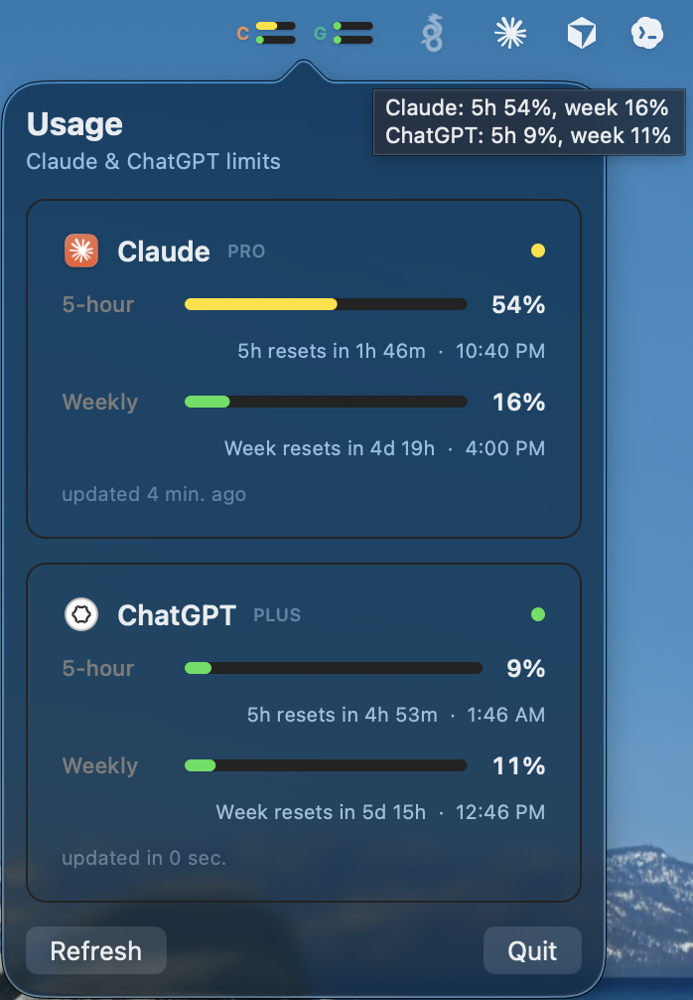

# Menubar Usage

<p align="center">
  
</p>

Tiny macOS menu bar gauges for your **Claude** and **ChatGPT / Codex** usage.

Menubar Usage shows both the rolling **5-hour** and **weekly** limits directly in
the menu bar, with a click-through popover for exact percentages, reset times,
plan labels, and refresh status. It is menu-bar-only, has no Dock icon, and reads
from the accounts you are already signed into locally.

## Features

- Compact menu bar display with one cell for Claude and one for ChatGPT.
- Two gauges per provider: **5-hour** on top, **weekly** below.
- Color-coded usage: green, yellow, orange, then red as limits get tight.
- Popover with percentages, reset countdowns, clock times, plan labels, and
  last-updated text.
- Manual refresh and quit controls from the popover.
- Local-only authentication: no extra login flow, backend, analytics, or hosted
  service.
- Offline estimates when live usage endpoints are unavailable.
- LaunchAgent installer for starting automatically at login.

## Install

Requires macOS 13+ and a Swift 6 toolchain, such as Xcode 16+.

```bash
git clone https://github.com/sshilal1/menubar-usage.git
cd menubar-usage
./scripts/install.sh
```

The installer builds a release binary, ad-hoc signs it, installs it to
`~/.local/bin/menubar-usage`, and registers a LaunchAgent named
`com.local.menubar-usage`.

To uninstall:

```bash
./scripts/install.sh uninstall
```

## Build From Source

```bash
swift build -c release
.build/release/menubar-usage
```

Run a one-shot diagnostic readout without launching the UI:

```bash
.build/release/menubar-usage --once
```

For extra collector tracing:

```bash
MENUBAR_USAGE_DEBUG=1 .build/debug/menubar-usage --once
```

Logs are also written to:

```text
~/Library/Logs/menubar-usage.log
```

## How It Works

Menubar Usage reads the same local credentials and usage sources used by the
tools you already run. There is no cloud component in this app.

**Claude**

Uses `GET https://api.anthropic.com/api/oauth/usage` with the OAuth token from
`~/.claude/.credentials.json`, or from the macOS Keychain item
`Claude Code-credentials` when the credentials file is not present. If live usage
cannot be read, it estimates from local Claude project JSONL files.

**ChatGPT / Codex**

Uses `GET https://chatgpt.com/backend-api/wham/usage` with the token in
`~/.codex/auth.json`. If live usage cannot be read, it estimates from local Codex
session rollout JSONL files.

## Privacy

- No telemetry.
- No bundled third-party dependencies.
- No account credentials are stored by this app.
- Network requests go directly from your Mac to the Claude and ChatGPT usage
  endpoints.
- Local fallback estimates are computed from files already on your machine.

## First Run Notes

If your Claude token is stored only in the macOS Keychain, macOS may ask:

```text
menubar-usage wants to use the Claude Code-credentials keychain item.
```

Choose **Always Allow** if you want live Claude numbers. Until approved, the app
falls back to local estimates and marks them as estimated in the popover.

The installed binary is ad-hoc signed so Keychain approval can bind to a stable
identity for that build. Reinstalling after code changes can trigger a new prompt
because ad-hoc signatures change.

## Configuration

Anthropic does not publish exact Claude token budgets for every plan. The live
Claude endpoint wins when available, but the offline estimate can be tuned with:

```json
{
  "claudeFiveHourTokenBudget": 90000000,
  "claudeWeeklyTokenBudget": 440000000,
  "claudePlanLabel": "Max 20x"
}
```

Save it at:

```text
~/.config/menubar-usage/config.json
```

## Troubleshooting

**The app shows estimates instead of live Claude usage.**

Approve the Keychain prompt once, then click the menu bar gauge and press
**Refresh**.

**One provider is stuck on `Updating...`.**

Run:

```bash
MENUBAR_USAGE_DEBUG=1 .build/debug/menubar-usage --once
```

Then check `~/Library/Logs/menubar-usage.log`.

**Usage suddenly stops updating.**

The Claude and ChatGPT usage endpoints are unofficial and may change. Confirm the
local token files still exist, then run the diagnostic command above.

## Screenshot Assets

The README screenshots are generated from mock data using the app's own AppKit
views:

```bash
swiftc -module-cache-path /tmp/menubar-usage-swift-cache \
  Sources/MenubarUsage/UsageModel.swift \
  Sources/MenubarUsage/Views.swift \
  Sources/MenubarUsage/PopoverViewController.swift \
  scripts/render-readme-screenshots.swift \
  -o /tmp/render-readme-screenshots

/tmp/render-readme-screenshots
```

This avoids publishing personal usage data while keeping the screenshots close to
the real UI.

## Inspiration & Credits

The data-collection approach is adapted from Neelash Kannan's
[usage-touchbar](https://github.com/neelashkannan/usage-touchbar).

Public-facing polish was inspired by projects in this space such as
[ClaudeUsageBar](https://github.com/Artzainnn/ClaudeUsageBar) and
[claudeusagebar.com](https://www.claudeusagebar.com/).
